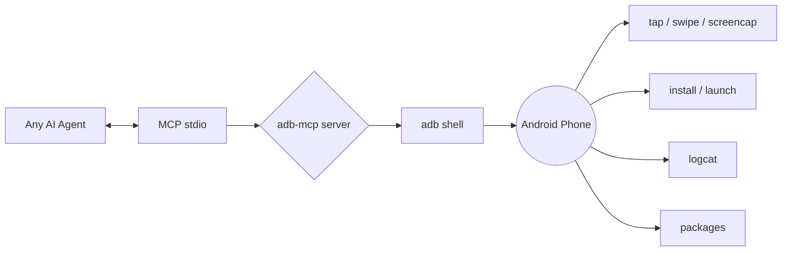

<p align="center">
  
</p>

<p align="center">
  
  
  
  
  
</p>

> [!TIP]
> **A single star is the cheapest thank-you** — ⭐ the repo if this is useful. It's the only thing that helps other people find it.

# 🤖 adb-mcp — Let AI agents drive your Android phone

> Turn `adb` into a full **Model Context Protocol** surface. Tap, swipe, screencap,
> install, read packages, watch logcat — directly from Claude, Cursor, or any MCP-capable
> agent. **Your phone becomes an AI-controlled device.**

## Why

- **"AI controls your phone" is the 2026 demo** — and `adb` is the closest thing to a universal phone API.
- One command to mount your device as a set of tools any agent can call.
- Works over WiFi (`adb pair/connect`) or USB on Linux, macOS, Windows, and **Termux on Android**.
- Zero cloud — everything stays on your local machine. Private by design.

## Install

```bash
pipx install adb-mcp        # or: pip install adb-mcp
adb-mcp                     # stdio transport, targets default device
```

Or run with an explicit device:

```bash
adb-mcp --device <serial>
```

### Plug into Claude Desktop

Add this to `claude_desktop_config.json`:

```json
{ "mcpServers": { "adb": { "command": "adb-mcp" } } }
```

### Plug into Cursor

Add a new MCP server entry with command `adb-mcp` and type `stdio`.

## Quick start (no device needed)

Try it against the built-in mock adb, fully offline:

```bash
adb-mcp --mock
python -m pytest tests/ -q        # 5 passing tests, zero hardware needed
```

## Included tools

| Category   | Tools |
|------------|-------|
| Devices    | `list_devices` |
| Screen     | `screencap`, `tap`, `swipe` |
| Input      | `input_text`, `keyevent` |
| Apps       | `list_packages`, `install_apk`, `launch` |
| Diagnostics| `battery`, `logcat` |

Each tool runs a scoped, time-limited `adb shell`/`adb exec-out` call — no root, no
persistent anything.

## Project layout

```
adb-mcp/
├─ pyproject.toml        # hatchling build, `adb-mcp` console script
├─ adb_mcp/
│  ├─ server.py          # FastMCP server + all tool registrations
│  ├─ adb.py             # Adb / MockAdb transport
│  └─ __init__.py
├─ tests/test_tools.py    # mock-based, device-free tests
└─ README.md
```

## Where to go next (roadmap)

- [ ] over-screenrecord GIF framing for the README demo
- [ ] `files/` module: scoped push/pull
- [ ] `CE/` streaming logcat
- [ ] pairing wizard for wireless `adb pair`
- [ ] topic badges + GH Actions test on push

---

<p align="center">
  <b>Part of the <a href="https://github.com/axe01010/axe01010">Free On-Device AI DevKit</a> stack</b>
</p>
<p align="center">
  <a href="https://github.com/axe01010/android-ai-agent">android-ai-agent</a> ·
  <a href="https://github.com/axe01010/on-device-llm-mobile">on-device-llm-mobile</a> ·
  <a href="https://github.com/axe01010/mcp-server-hub">mcp-server-hub</a> ·
  <a href="https://github.com/axe01010/termux-toolkit">termux-toolkit</a>
</p>

<div align="center">Built for the <b>Free On-Device AI DevKit</b> — private AI that runs entirely on a phone.</div>

## Architecture


